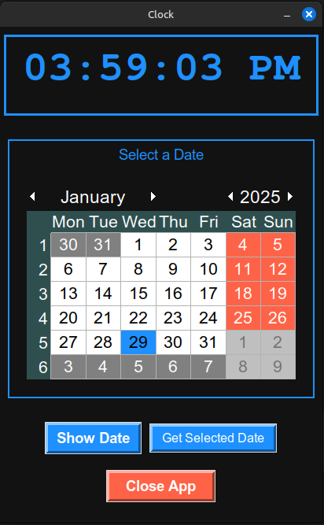

# Python Clock and Calendar  

This is a **Clock and Calendar** application built using **Python** and **Tkinter**. It displays the current time in a digital clock format and includes a date selection feature using a calendar widget.

## Features  
- 🕒 **Digital Clock** with real-time updates  
- 📅 **Calendar Widget** to select dates  
- 🎨 **Modern UI** with a stylish theme  
- 📌 **Buttons** to display selected date and close the app  

## Requirements  
Make sure you have the following dependencies installed:  
- Python 3.x  
- `tkinter` (built-in with Python)  
- `tkcalendar` (for the calendar widget)  

To install `tkcalendar`, run:  
```bash
pip install tkcalendar
pip install python3-tk


